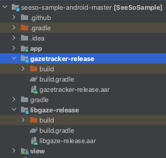
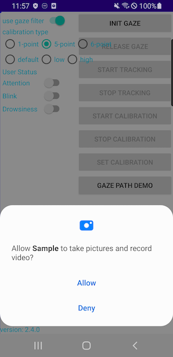

<p align="center">
    
</p>
<div align="center">
    <h1>SeeSo Android Sample</h1>
    <a href="https://github.com/visualcamp/seeso-sample-android/releases" alt="release">

        
    </a>
</div>

## SeeSo
SeeSo is an AI based eye tracking SDK which uses image from RGB camera to track where the user is looking.
Extra hardware is not required and you can start your development for free.
In 2021, SeeSo was recognized for its innovative technology and won GLOMO Award for Best Mobile Innovation for Connected Living!
1. Supports multi-platform (iOS/Android/Unity/Windows/Web-JS)
2. Has simple and quick calibration (1-5 points)
3. Has high accuracy and robustness compared to its competitors.


## Documentation
* Overview: https://docs.seeso.io/nonversioning/document/seeso-sdk-overview
* Quick Start: https://docs.seeso.io/nonversioning/quick-start/android-quick-start
* API: https://docs.seeso.io/docs/api/android-api-docs

## Requirements
* minSdkVersion: 23
* targetSdkVersion: 30
* It must be run on a real Android device.
* It must be an internet environment.
* [SeeSo Android SDK](https://manage.seeso.io/)
* Must be issued a license key in [SeeSo Manage](https://manage.seeso.io/)

## Setting License Key
* Get a license key from https://manage.seeso.io and copy your key to [`GazeTrackerManager.java`](/app/src/main/java/visual/camp/sample/app/GazeTrackerManager.java#L41)
   ```
   // TODO: change licence key
   String SEESO_LICENSE_KEY = "your license key";
   ```

## How to run
1. Clone or download this project.
2. Copy the extracted `aar` into this project's [`libgaze-release` directory](libgaze-release/), [`gazetracker-release` directory](gazetracker-release/)  
    By now, the project structure should be like below  
    
3. Grant Camera Permission.

    

## Add proguard rule (optional)
When building an Android App with minify enabled, some rules must be added to proguard-rules.pro in order to make the SeeSo SDK work properly.

Insert below code into app module's [`proguard-rules.pro`](app/proguard-rules.pro).
```
-keep class camp.visual.libgaze.callbacks.JNICallbackDispatcher {
  *;
}
```
      
## Contact Us
If you have any problems, feel free to [contact us](https://seeso.io/Contact-Us) 
